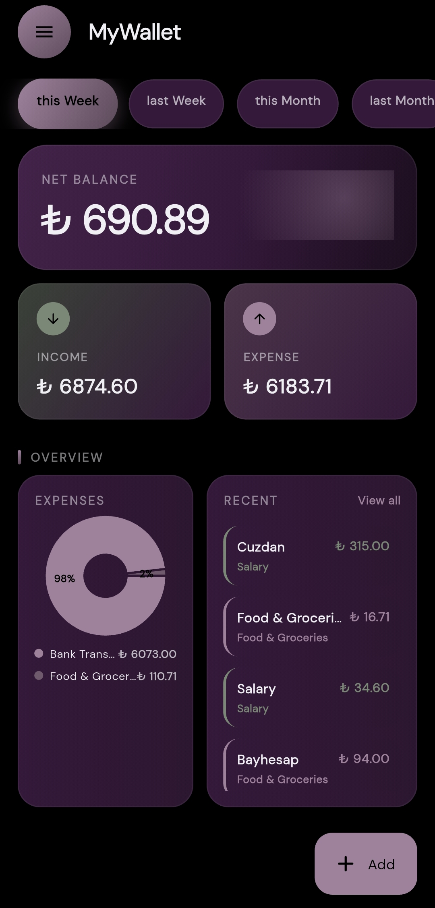
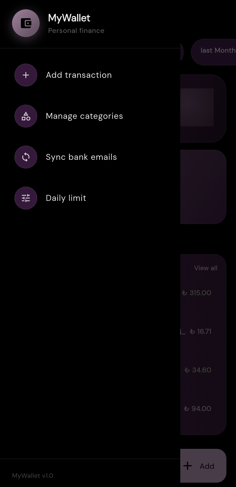

# MyWallet - Ziraat Bank Automation 🏦📈

A robust, offline-first personal finance tracker built with Flutter. MyWallet automates the tedious process of manual expense tracking by securely parsing unread bank transaction emails via IMAP, categorizing them, and updating a reactive dashboard in real-time.

## ✨ Key Features

* **Automated Data Pipeline:** Integrates an IMAP client to fetch and securely read automated bank emails (Ziraat Bankası) entirely on the device.
* **Smart Regex Parsing:** Sanitizes raw, unstructured HTML emails and extracts precise transaction data (Dates, Minor/Major Units, Senders/Receivers, FAST transfers) using strict Regular Expressions.
* **Local Persistence Sandbox:** Utilizes an isolated SQLite database to store transactions and custom user categories offline, ensuring complete data privacy.
* **Reactive Architecture:** Built on a Riverpod state management foundation. The UI, data repository layer, and background parsers remain perfectly synchronized without requiring manual state refreshes.
* **Dynamic Categorization Engine:** Automatically intercepts, maps, and sorts incoming/outgoing automated transactions. It intelligently falls back to recognized internal database IDs to prevent UI state rendering errors.

## 📱 Screenshots

| Dashboard | SideBar |
| :---: | :---: |
|  |  |

## 🛠 Tech Stack

* **Framework:** Flutter / Dart
* **State Management:** Riverpod
* **Database:** SQLite
* **Email Client:** enough_mail (IMAP)

## 🚀 Architectural Challenges Overcome

Building this application required navigating complex mobile development hurdles:
1. **R8 Compiler Stripping:** Resolved silent runtime failures in Android Release builds by overriding build.gradle rules to protect core data models.
2. **State-Sync Fallbacks:** Engineered a bulletproof fallback mechanism for the UI to prevent unhandled ID exceptions when dynamically generating SQL database categories during background tasks.

## ⚙️ Getting Started

### Prerequisites
* Flutter SDK (latest stable)
* An App Password generated from your email provider (e.g., Gmail) to allow secure IMAP access.

### Installation

1. Clone the repository:
   git clone https://github.com/muhammedham/automated-finance-tracker.git

2. Get dependencies:
   flutter pub get

3. Set up your environment variables (ensure your personal IMAP credentials are not hardcoded!).

4. Run the app:
   flutter run

## 👤 Author

**Muhammed Hamadin**
* Software Engineer
* GitHub: https://github.com/muhammedham
